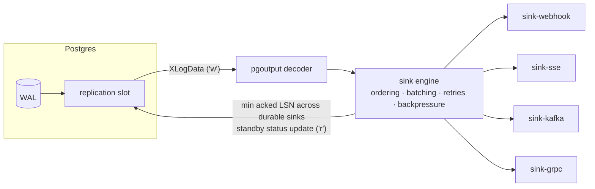

<h1 align="center">walcast</h1>

<p align="center">
  Postgres change data capture for Node — a hand-written <code>pgoutput</code> decoder,<br>
  an async iterator with explicit LSN acknowledgment, and a plugin engine for delivery.
</p>

<p align="center">
  <a href="https://github.com/ManasMadan/walcast/actions/workflows/ci.yml"></a>
  <a href="https://www.npmjs.com/package/walcast"></a>
  <a href="./LICENSE"></a>
  = 20">
</p>

> **The core does the least, best, for the most. Everything that transports
> events is a plugin.** Walcast ships zero sinks — the same way
> `@babel/core` ships zero transforms and PostCSS ships zero plugins.

```bash
npm install walcast
```

```ts
import { Walcast } from 'walcast'

const tr = new Walcast({ connection: process.env.DATABASE_URL! })
await tr.setup() // create publication + replication slot, idempotent

for await (const event of tr.changes()) {
  console.log(event.op, event.table, event.after)
  tr.ack(event) // the slot only advances past what you ack
}
```

That is the whole zero-plugin experience: **your own code is the sink.**
No daemon, no queue, no sidecar — a library reading the WAL over the
streaming replication protocol, decoding `pgoutput` frames itself, and
redelivering anything you didn't ack if you crash.

_[demo GIF placeholder — `npm run demo` and the live inspector at `/ui`]_

## How it fits together



The feedback loop is the design: each durable sink checkpoints the LSN it
has delivered (in a `walcast.sinks` table next to your data), and the slot
only advances to the **minimum acked LSN across durable sinks**. Ephemeral
sinks (live tails) are excluded and can never hold WAL back.

## Daemon mode

When something should receive events on your behalf, run the daemon and
install transports:

```bash
npm install walcast @walcast/sink-webhook
npx walcast serve
```

| Package                                             | Transport                          | Durability |
| --------------------------------------------------- | ---------------------------------- | ---------- |
| [`@walcast/sink-webhook`](./packages/sink-webhook) | HTTP POST, HMAC-SHA256 signed      | durable    |
| [`@walcast/sink-sse`](./packages/sink-sse)         | live Server-Sent Events endpoint   | ephemeral  |
| [`@walcast/sink-kafka`](./packages/sink-kafka)     | Kafka, exactly-once into the topic | durable    |
| [`@walcast/sink-grpc`](./packages/sink-grpc)       | push to your gRPC server           | durable    |

Starting with zero sinks configured exits with an error that tells you
exactly this. The daemon serves a dashboard at `/ui` (bearer token) —
current LSN, slot lag, per-sink queue depth and checkpoint, pause/resume,
and a live event inspector.

Writing your own transport is a ~50-line package against
[`@walcast/plugin-kit`](./packages/plugin-kit), verified by the same
conformance harness the official sinks pass in CI. Start from
[`templates/plugin`](./templates/plugin) or the
[15-minute tutorial](https://walcast.mmadan.in/guide/writing-a-sink).

## Delivery guarantees, stated precisely

- **At-least-once delivery** with **deterministic, LSN-derived event ids**
  (`commit_lsn:index`). A redelivered event carries the identical id, so
  consumers get exactly-once _processing_ with an idempotency check.
- **Exactly-once _into Kafka_**: the Kafka sink writes each batch and its
  checkpoint in one Kafka transaction; consumers use `read_committed`.
  Both crash windows are covered — see the
  [delivery-guarantees deep dive](https://walcast.mmadan.in/guide/delivery-guarantees).
- Exactly-once _delivery_ over webhooks/SSE is impossible (the receiver can
  fail between processing and acknowledging), and walcast never claims it.

## Numbers

Measured end-to-end by `npm run bench` (M-series laptop, dockerized
Postgres 16 + single-node Kafka, 4 writers, single-row transactions):

| metric                                 | result                                                    |
| -------------------------------------- | --------------------------------------------------------- |
| sustained throughput                   | **3,689 events/s** (55,351 committed transactions in 15s) |
| commit → webhook                       | **p50 5 ms · p95 10 ms**                                  |
| commit → Kafka (EOS, `read_committed`) | **p50 24 ms · p95 68 ms**                                 |

## Compared to

|                        | walcast                         | Debezium                    | Supabase Realtime | Sequin         |
| ---------------------- | -------------------------------- | --------------------------- | ----------------- | -------------- |
| runtime                | Node library or tiny daemon      | JVM + Kafka Connect cluster | hosted / Elixir   | Elixir service |
| Kafka required         | optional (one sink)              | effectively yes             | no                | no             |
| embeddable in your app | **yes — async iterator**         | no                          | no                | no             |
| delivery               | at-least-once (+ EOS into Kafka) | at-least-once               | best-effort       | at-least-once  |
| transports             | open plugin contract             | Connect ecosystem           | WebSockets        | HTTP push/pull |
| dashboard              | built in                         | via Kafka tooling           | hosted console    | built in       |

Debezium is the battle-tested heavyweight with a huge connector ecosystem;
if you already run Kafka Connect, use it. Supabase Realtime is for live
UIs, not reliable pipelines. Sequin is the closest cousin —
product-shaped, whereas walcast is library-first with plugins.
[Honest comparison page →](https://walcast.mmadan.in/guide/comparisons)

## Limitations you should know before production

- **Single instance per slot.** Postgres enforces one consumer; there is no
  HA/failover yet ([roadmap](./ROADMAP.md)).
- **An abandoned slot retains WAL forever and will fill the disk.** Run
  `npx walcast teardown` when you stop using it, and monitor:
  ```sql
  SELECT slot_name, pg_wal_lsn_diff(pg_current_wal_lsn(), restart_lsn) AS retained_bytes
  FROM pg_replication_slots;
  ```
- `before` images require `ALTER TABLE ... REPLICA IDENTITY FULL`.
- Unchanged TOAST columns arrive as the `UNCHANGED_TOAST` sentinel, not the
  value (they are not in the WAL).
- `bigint`/`numeric` columns arrive as strings — precision is never
  silently lost.
- Transactions are delivered after COMMIT (pgoutput proto v1); Postgres 14+.

## Repository

```
packages/walcast        core: library + engine + CLI + daemon + dashboard assets (deps: pg)
packages/plugin-kit      the Sink contract + conformance harness (zero deps)
packages/sink-*          official transports, each its own package
packages/typegen-prisma  typed events from a Prisma schema (pure codegen)
apps/ui                  the dashboard SPA, built into the walcast package
templates/plugin         copyable starter for community sinks
examples/                one example per concept
docs/                    the documentation site
```

- **Docs:** https://walcast.mmadan.in
- **Try it:** `docker compose up --build`, then `npm run demo`, then open
  `http://127.0.0.1:7717/ui/?token=demo`
- **Contribute:** [CONTRIBUTING.md](./CONTRIBUTING.md) — sink plugins are
  the best first contribution, and they live in your repo, not this one.
- **Why is X like that?** [DECISIONS.md](./DECISIONS.md). **What's next?**
  [ROADMAP.md](./ROADMAP.md).

## License

MIT © Manas Madan
